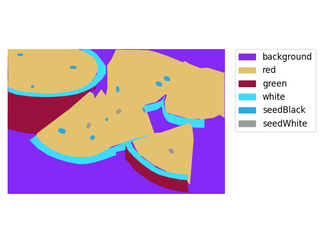
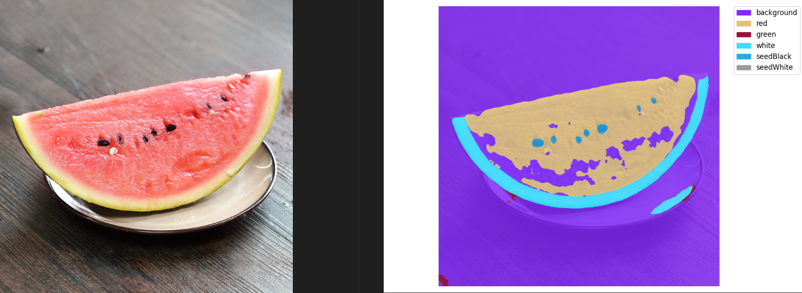

# 西瓜数据集划分

## 主要步骤

1. Labelme 标注语义分割数据集
2. 划分训练集和测试集
3. Labelme 标注转 Mask 灰度图格式

## 文件作用

- analysis_dataset.py, 分析数据集中的 Mask 中包含多少种类的数字，对 mask 进行可视化；

- pspnet_config.py, 配置文件，包含数据集，模型结构；
- train.py, 训练模型；
- predict.py, 利用训练的模型进行预测；

## 训练结果

最终模型的准确率如下所示：

```shell
+------------+-------+-------+
|   Class    |  IoU  |  Acc  |
+------------+-------+-------+
| background |  84.7 | 97.71 |
|    red     | 78.95 | 80.99 |
|   green    | 55.78 | 64.25 |
|   white    | 66.68 | 68.74 |
| seedBlack  | 60.29 | 86.41 |
| seedWhite  |  0.15 |  0.15 |
+------------+-------+-------+
```

预测的结果如下图所示，左侧为真实图像，右侧为分割后的结果：

